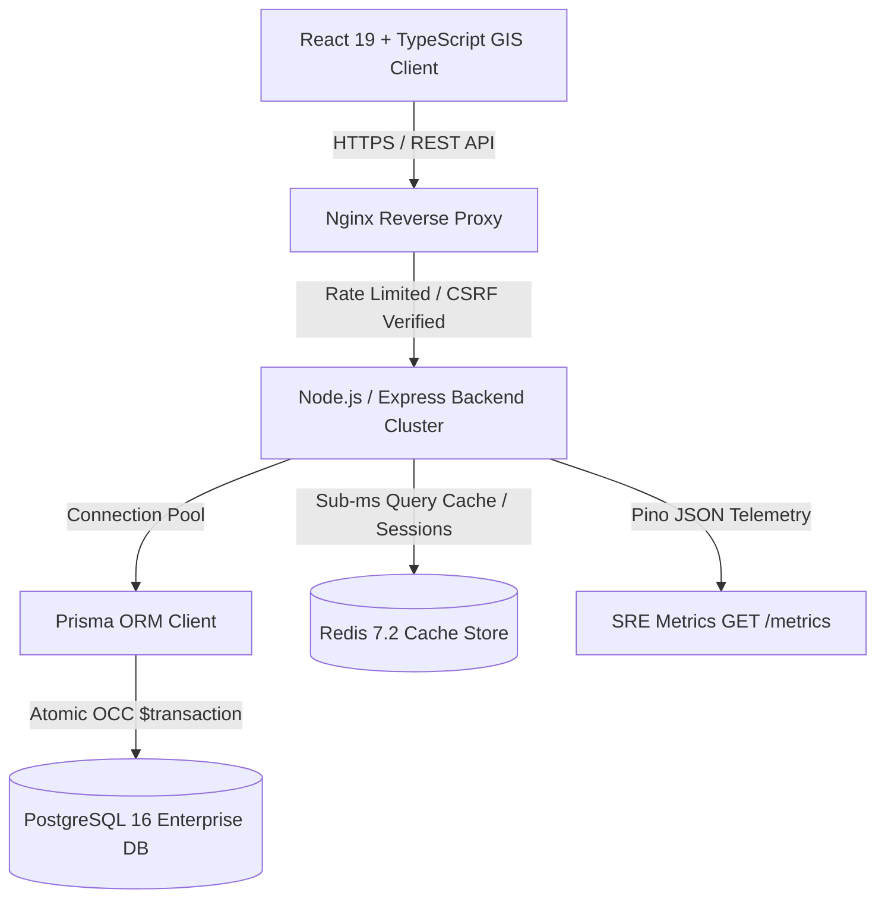
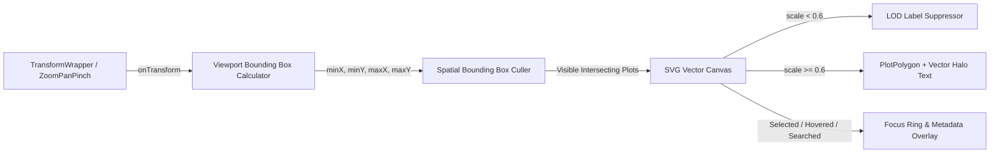
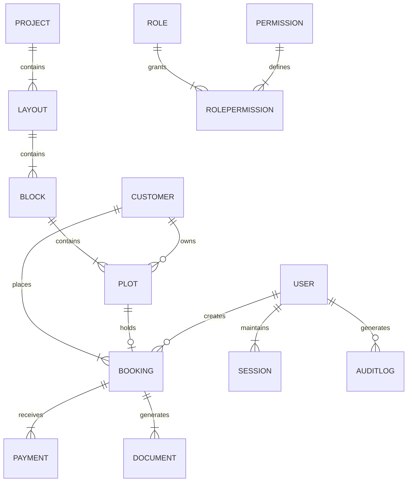

# 🏰 Shubharambh CRM — Enterprise GIS Real Estate & Sales Network Engine

[](https://github.com/ashoksh191/shubharambh-crm)
[](LICENSE)
[](docker-compose.yml)
[](server/prisma/schema.prisma)
[](server/src/config/redis.ts)
[](tsconfig.json)
[](e2e/)
[](src/__tests__/)

A production-grade, enterprise-ready **Real Estate Township Management System & GIS Vector Map Engine** built for **Shubharambh Green City** (60-Bigha Master Township, 1,081 Plot Inventory, and MLM Sales Network).

---

## 🌟 Executive Key Features

1. **High-Performance SVG GIS Engine**:
   - **Viewport Spatial Bounding Box Culling**: Renders only plot polygons intersecting the active screen coordinates (`minX`, `minY`, `maxX`, `maxY`), maintaining $<300$ active SVG DOM nodes even across massive 100,000-plot blueprints.
   - **Adaptive Level of Detail (LOD)**: Automatically controls plot label text visibility based on zoom scale, ensuring smooth 60 FPS pan/zoom performance.
   - **Vector Overlay**: Real-time layer toggling for roads, parks, commercial reserves, and master architectural blueprint images.

2. **Server-Authoritative Concurrency Control (OCC)**:
   - **Double-Booking Prevention**: Plot booking requests execute within PostgreSQL `$transaction` boundaries.
   - **Optimistic Concurrency Control**: Uses atomic `Plot.version` increments to reject race conditions with `HTTP 409 Conflict`. Zero local storage fallbacks for bookings.

3. **Enterprise Security & RBAC**:
   - **Dual JWT Token Rotation**: Short-lived access tokens (15 mins) and HTTP-Only, SameSite=Strict refresh cookies.
   - **8 System Roles**: `SUPER_ADMIN`, `ADMIN`, `SALES_MANAGER`, `SALES_EXECUTIVE`, `FINANCE`, `ASSOCIATE`, `CUSTOMER_SUPPORT`, `VIEWER`.
   - **Security Protections**: Bcrypt password hashing (12 rounds), Helmet headers, CSRF double-submit cookie verification, input sanitization, and 2FA TOTP QR codes.

4. **Distributed Redis Platform Architecture**:
   - **Query Caching**: `GET /api/v1/plots` cached in Redis 7.2 (300s TTL) with instant pattern-based cache invalidation (`plots:*`) upon booking.
   - **Distributed Session Storage**: Instant session revocation (`revoked_session:sessionId`) and active device tracking.
   - **Rate Limiting & Telemetry**: Redis hash counters for cluster-wide rate limits and process telemetry (`metrics:http`).

5. **Production SRE Observability**:
   - Pino JSON structured logging, `x-request-id` correlation tracing across client/server, slow request alerts ($\ge 500\text{ms}$), and Prometheus JSON telemetry (`GET /metrics`).

---

## 🏗️ System Architecture



---

## 🗺️ GIS Engine Architecture



---

## 🗄️ Database Entity-Relationship Diagram



---

## 📁 Repository Folder Structure

```text
shubharambh-crm/
├── e2e/                         # Playwright E2E Automation Specs
│   ├── auth.spec.ts             # Login, Token Refresh & Logout Tests
│   ├── booking.spec.ts          # Booking & OCC Conflict Tests
│   ├── propertyMap.spec.ts      # Vector GIS Canvas & Plot Click Tests
│   └── rbac.spec.ts             # Unauthorized Access & RBAC Tests
├── server/                      # Enterprise Express Backend Application
│   ├── prisma/                  # Prisma Schema & PostgreSQL Migrations
│   │   ├── migrations/          # SQL DDL Migration Scripts
│   │   └── schema.prisma        # 17 Relational Entity Definitions
│   ├── src/
│   │   ├── config/              # Redis (redis.ts) & Database (database.ts)
│   │   ├── controllers/         # API Request Handlers
│   │   ├── middlewares/         # Auth, RBAC, Rate Limiter, Audit, Request ID
│   │   ├── routes/              # Express API Endpoint Registries
│   │   ├── services/            # Core Business Logic & Redis Caching
│   │   └── server.ts            # Server Entry Point & Graceful Shutdown
│   ├── Dockerfile               # Multi-stage Backend Container Build
│   └── package.json
├── src/                         # React 19 Frontend Application
│   ├── components/              # Modular UI Components & Modals
│   ├── context/                 # AuthContext & AppContext State Providers
│   ├── features/
│   │   └── gis-engine/          # Modular GIS Spatial & Rendering Pipeline
│   │       ├── geometry/        # Point-in-polygon & Spatial Math
│   │       ├── layers/          # Plot, Boundary, Road, Park, Label Layers
│   │       ├── renderer/        # SvgCanvas.tsx Viewport Spatial Culler
│   │       └── spatial/         # Quadtree Bounding Box Indexing
│   ├── services/                # API Client & Interceptors
│   └── types/                   # TypeScript Interfaces & Models
├── docker-compose.yml           # Nginx + Node + PostgreSQL 16 + Redis 7.2 Stack
├── playwright.config.ts         # Playwright E2E Test Suite Config
├── vite.config.ts               # Vite Production Bundler Config
└── README.md
```

---

## 🛠️ Technology Stack

- **Frontend Core**: React 19, TypeScript 5.7, Framer Motion, Lucide Icons, `react-zoom-pan-pinch`.
- **Styling**: Modern CSS3, Dark Mode Glassmorphism, HSL tailwind-free token system.
- **Backend Core**: Node.js 22, Express 4.x / 5.x, TypeScript.
- **Database & ORM**: PostgreSQL 16, Prisma ORM 6.x (Connection Pool Singleton).
- **Caching & Sessions**: Redis 7.2 Alpine, `ioredis` (In-Memory Fallback Store).
- **Security**: JWT Access/Refresh Token Rotation, Bcrypt (12 salt rounds), Helmet, CSRF protection, TOTP 2FA.
- **Testing**: Vitest (46/46 unit/integration), Playwright (11/11 E2E automation).
- **DevOps**: Docker Multi-stage, Docker Compose, Nginx, GitHub Actions CI/CD.

---

## ⚡ Quick Start & Installation

### Prerequisites
- Node.js $\ge 20.0$
- PostgreSQL $\ge 16.0$
- Redis $\ge 7.0$ (Optional, fallback enabled)

### 1. Local Development Setup

```bash
# Clone the repository
git clone https://github.com/ashoksh191/shubharambh-crm.git
cd shubharambh-crm

# Install Frontend & Backend Dependencies
npm install
cd server && npm install && cd ..

# Setup Environment Variables
cp server/.env.example server/.env

# Run Prisma Database Migrations & Client Generation
cd server
npx prisma generate
npx prisma db push
npm run prisma:seed
cd ..

# Launch Frontend & Backend Concurrent Dev Servers
npm run dev
```

Frontend: `http://localhost:5173` | Backend API: `http://localhost:5000`

---

## 🐳 Docker Deployment Guide

Launch the full production micro-service stack (Nginx + Express Backend + PostgreSQL 16 + Redis 7.2) with a single command:

```bash
# Build and launch Docker Compose stack in detached mode
docker-compose up --build -d

# Verify Container Health
docker-compose ps
```

Health Checks:
- API Health Probe: `GET http://localhost:5000/health`
- Readiness Probe: `GET http://localhost:5000/ready`
- Telemetry Metrics: `GET http://localhost:5000/metrics`

---

## 🧪 Testing & Quality Assurance

### Vitest Unit & Integration Suite (46 Tests)
```bash
npm run test
```

### Playwright End-to-End Suite (11 Tests)
```bash
npx playwright test
```

### Typecheck & Linter
```bash
npm run typecheck
npm run lint
```

---

## 🔐 Default Seed Accounts (Password: `Password@123456`)

| Role | Username | Email | Permissions |
| :--- | :--- | :--- | :--- |
| **Super Admin** | `superadmin` | `superadmin@shubharambh.com` | Full Administrative & System Access |
| **Admin** | `admin` | `admin@shubharambh.com` | Plot Editor, User Management, Approvals |
| **Sales Manager** | `salesmanager` | `salesmanager@shubharambh.com` | Plot Reservation & Associate Oversight |
| **Sales Executive** | `salesexec` | `salesexec@shubharambh.com` | Customer Onboarding & Booking Requests |
| **Finance** | `finance` | `finance@shubharambh.com` | Payment Approvals & Financial Dashboard |
| **Associate** | `associate` | `associate@shubharambh.com` | MLM Tree, Commission Ledger, Bookings |

---

## 📄 License

Distributed under the **MIT License**. See [`LICENSE`](LICENSE) for details.

---

## 🤝 Contributing

Contributions are welcome! Please read [`CONTRIBUTING.md`](CONTRIBUTING.md) before submitting pull requests.
