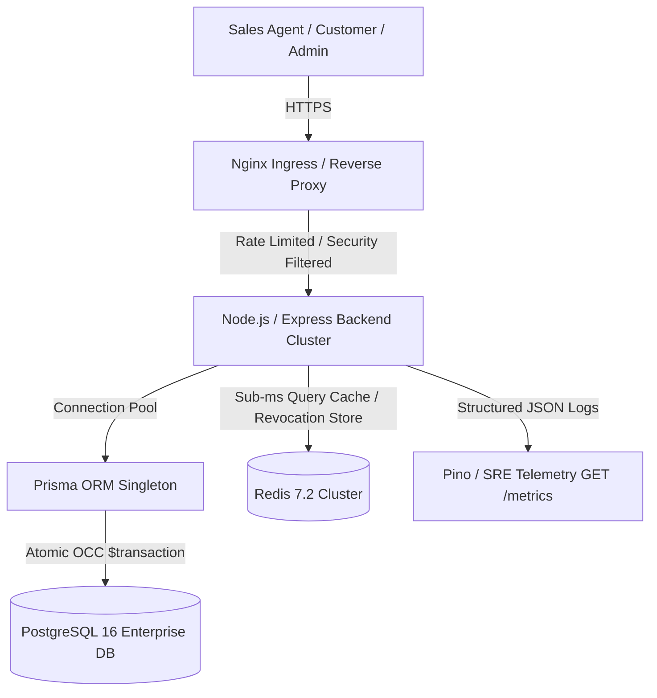
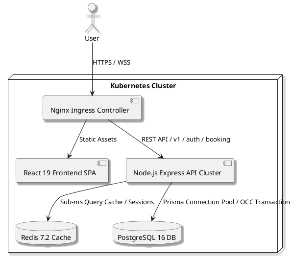
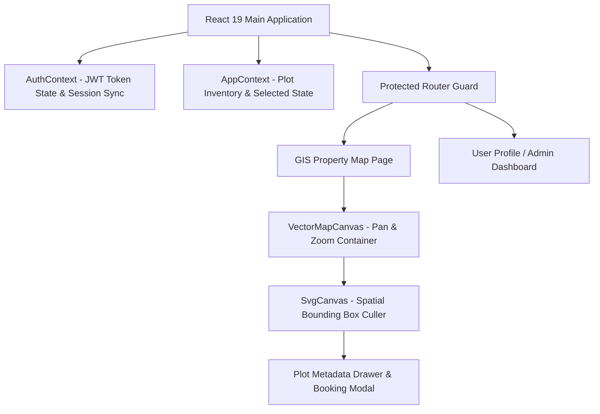
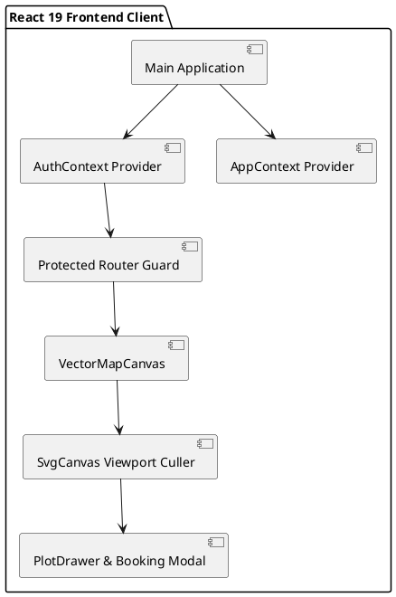
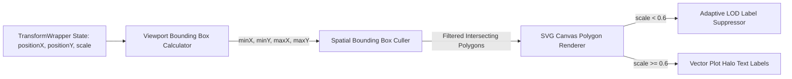
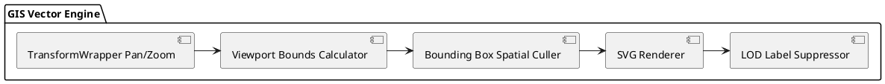
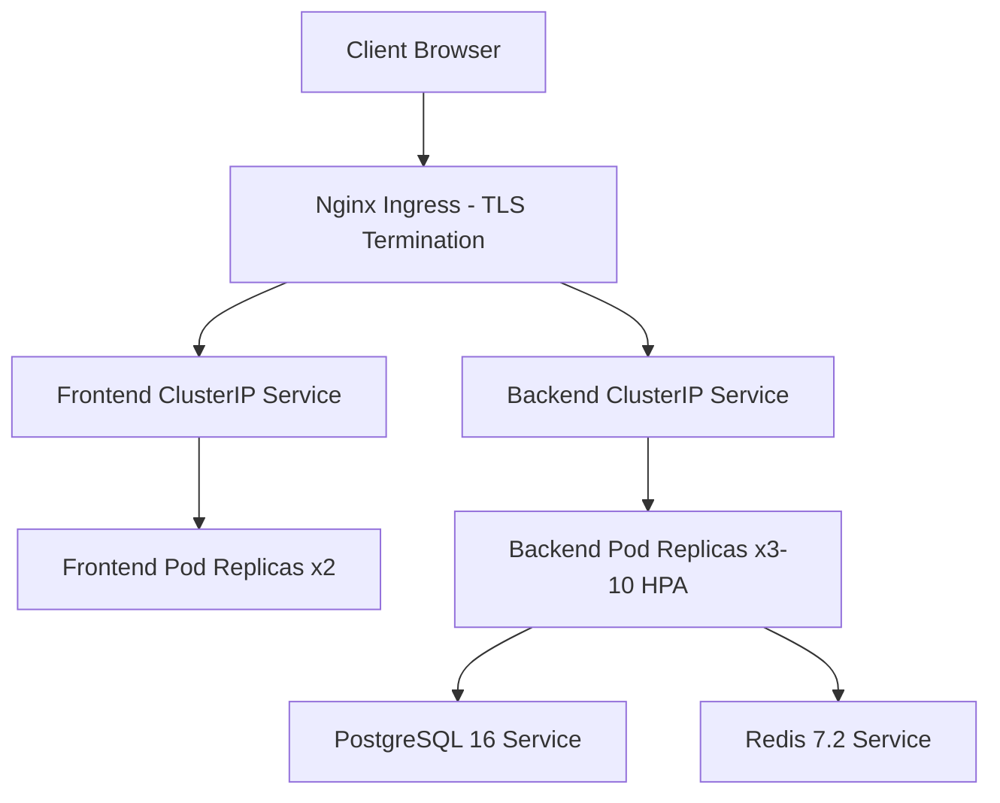
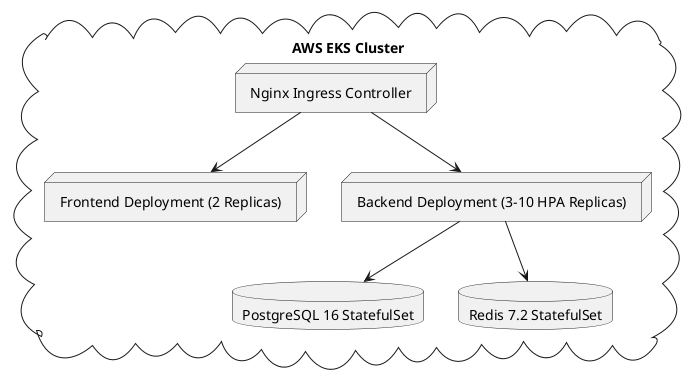

# 🏛️ Enterprise Architecture Guide — Shubharambh CRM

**Version**: `v1.0.0-rc1`  
**System Target**: Shubharambh Green City Real Estate Township & Sales Network  
**Target Scale**: 100 Concurrent Users, 50 Sales Agents, 100,000 Plots  

---

## 1. System Overview Architecture

Shubharambh CRM is designed as a high-performance 3-tier enterprise real estate management platform powered by Node.js, Express, PostgreSQL 16, Redis 7.2, and React 19.

---

## 2. Frontend Application Architecture

The frontend is built using React 19, TypeScript 5.7, Framer Motion, and custom state context providers (`AuthContext`, `AppContext`).

---

## 3. Backend Micro-Service Architecture

The backend follows a strict layered separation of concerns:

- **Controllers**: Handle HTTP requests, parse payloads, and return JSON responses.
- **Middlewares**: Enforce authentication (`authMiddleware`), RBAC (`rbacMiddleware`), rate limiting (`rateLimiter`), input sanitization (`uploadGuard`, `sanitizeInputs`), and logging (`requestIdMiddleware`).
- **Services**: Enforce domain business logic, caching (`plotService`, `sessionService`), and atomic transactional boundaries (`bookingService`).
- **Data Access Layer**: Prisma Singleton connection pool (`database.ts`) connected to PostgreSQL 16.

---

## 4. GIS Engine & Viewport Culling Architecture

---

## 5. Deployment & Kubernetes Infrastructure

