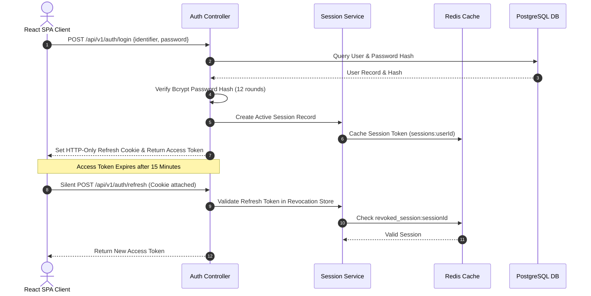
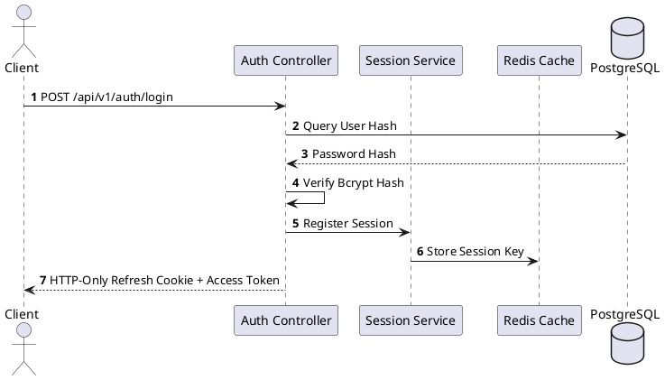
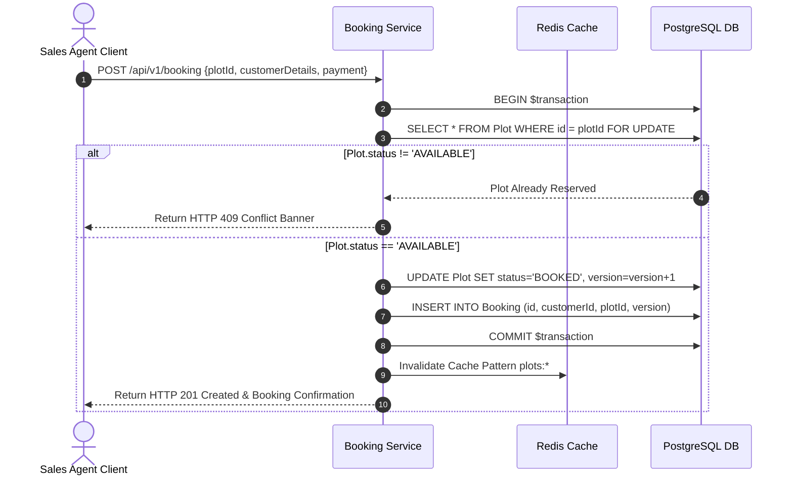
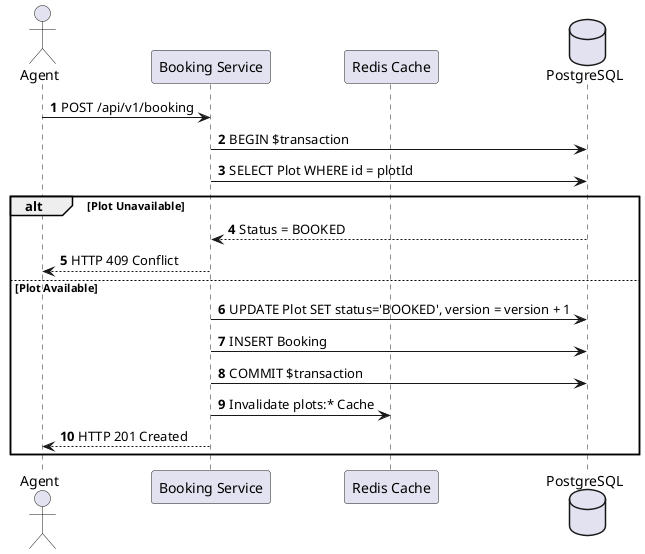
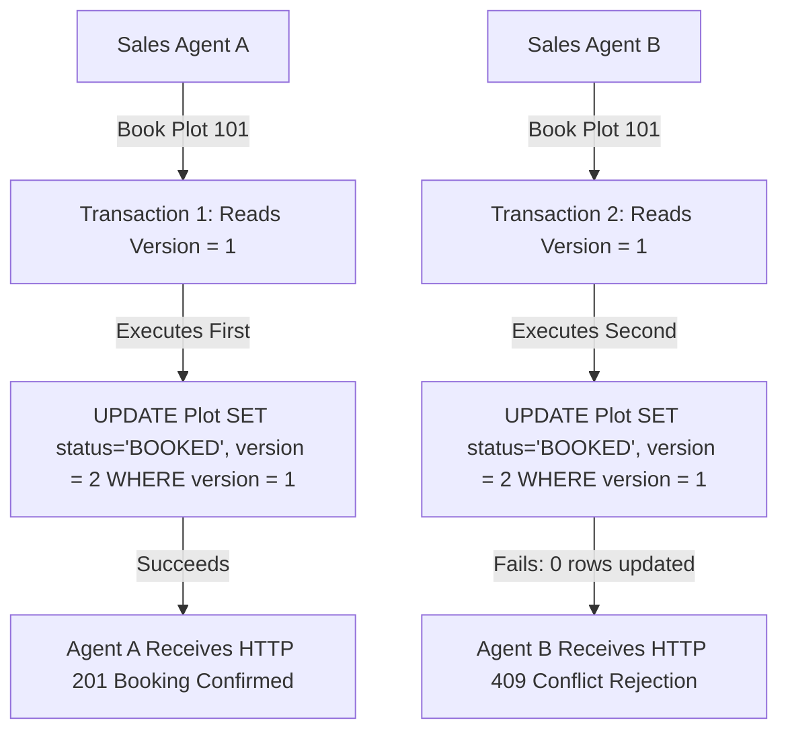
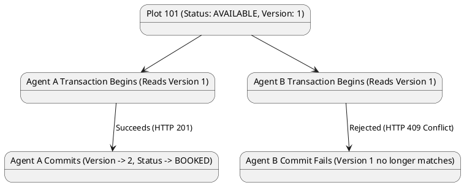
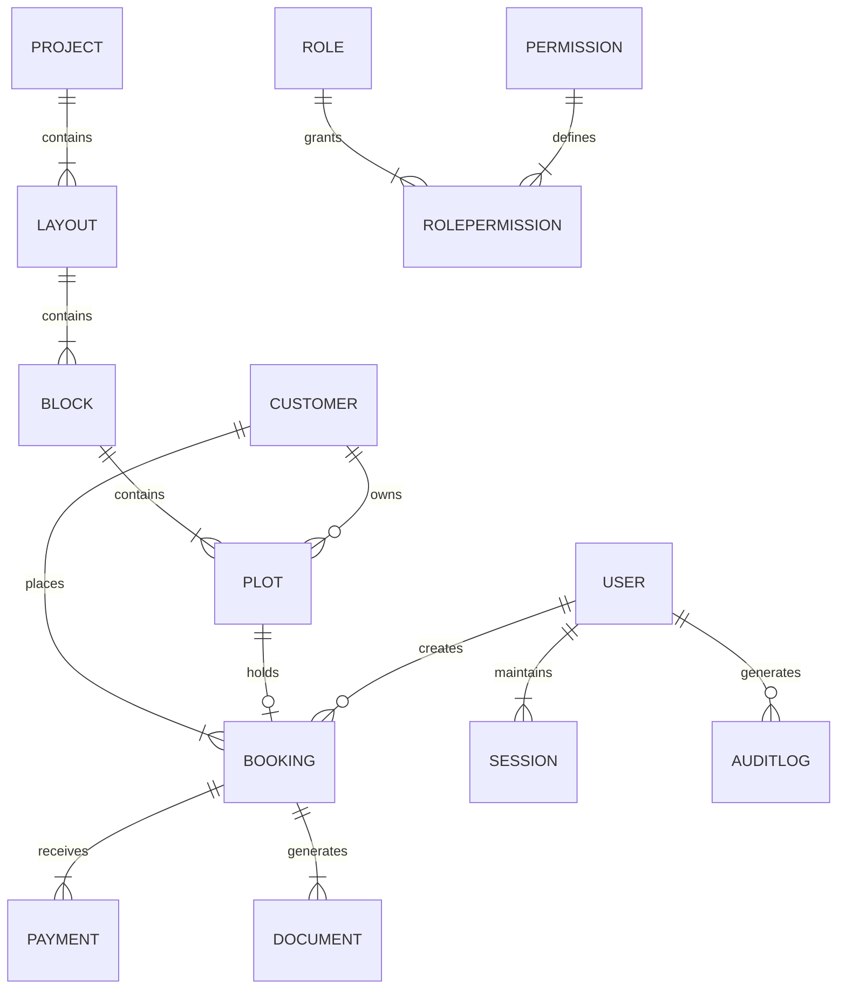
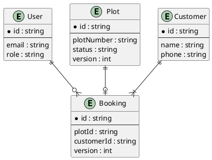

# 📊 Enterprise System Diagrams — Shubharambh CRM

This document contains complete technical sequence diagrams, database entity-relationship models, concurrency control flows, and repository folder trees for **Shubharambh CRM**.

---

## 1. Authentication & Token Rotation Flow





---

## 2. Server-Authoritative Booking Flow





---

## 3. Optimistic Concurrency Control (OCC) Flow





---

## 4. Database Entity-Relationship Diagram (ERD)





---

## 5. Repository Folder Structure Tree

```text
shubharambh-crm/
├── docs/                        # Enterprise Architecture Documentation
│   ├── ARCHITECTURE.md          # Core Architecture & System Guide
│   └── SYSTEM_DIAGRAMS.md       # Sequence, ERD & Concurrency Diagrams
├── e2e/                         # Playwright End-to-End Automation Specs
│   ├── auth.spec.ts             # Auth & Token Rotation Tests
│   ├── booking.spec.ts          # Booking & OCC Conflict Tests
│   ├── propertyMap.spec.ts      # Vector Canvas & Search Tests
│   └── rbac.spec.ts             # Unauthorized Access & RBAC Tests
├── k8s/                         # Production Kubernetes Deployment Manifests
│   ├── backend-deployment.yaml  # Express Backend Pod Deployment
│   ├── configmap.yaml           # Environment Configuration
│   ├── frontend-deployment.yaml # Frontend Nginx Pod Deployment
│   ├── hpa.yaml                 # Horizontal Pod Autoscaler (3-10 Pods)
│   ├── ingress.yaml             # TLS Nginx Ingress Controller
│   ├── secret.yaml              # Encrypted Production Credentials
│   └── services.yaml            # ClusterIP Service Routing
├── server/                      # Express Backend Micro-Service Application
│   ├── docs/                    # OpenAPI 3.1 Specification (json & yaml)
│   ├── prisma/                  # Prisma Schema & PostgreSQL Migrations
│   │   ├── migrations/          # DDL Migration Scripts
│   │   └── schema.prisma        # 17 Relational Entity Schemas
│   ├── src/                     # Backend TypeScript Source Code
│   │   ├── config/              # Redis & Database Singleton Pool
│   │   ├── controllers/         # API Controllers
│   │   ├── middlewares/         # Security, Auth, RBAC, Logging
│   │   ├── routes/              # Express API Routes
│   │   └── services/            # Business Logic & Caching Engine
│   └── Dockerfile               # Multi-Stage Backend Container Build
├── src/                         # React 19 Frontend Web Application
│   ├── components/              # Modular UI Components & Modals
│   ├── context/                 # AuthContext & AppContext Providers
│   ├── features/
│   │   └── gis-engine/          # Viewport Spatial Culler & LOD Renderer
│   ├── services/                # API Interceptors & Client
│   └── types/                   # TypeScript Interfaces & Models
├── docker-compose.yml           # Local Production Micro-Service Stack
├── package.json
├── README.md
└── vite.config.ts
```
